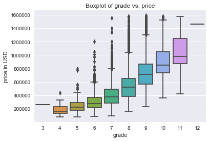
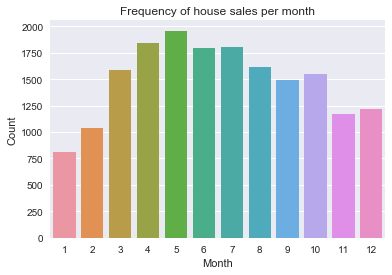

# Predicting House Prices in King County

This multivariate linear regression project was completed as part of Flatiron School's Data Science Bootcamp (Module 2 Final Project).

## Problem statement

As a junior data scientist at real estate company PropertiesInc., I have been tasked with investigating house sales in the King County area and building a model to predict the sale price. Key executives are keen to launch an advertising campaign directed towards home owners in that area who might consider selling their house, focusing on higher-end residential properties.

Before building the model, we will address the following descriptive questions through data exploration:

1. Which locations within the King County area have the highest average house prices?

Understanding what locations to focus the advertising campaign on is key for our stakeholders.

2. Which house attributes increase sale price?

Understanding home buyers' preferences can focus our campaign and help us guide clients willing to undertake renovations prior to selling.

3. Does time of the year have an impact on house sales?

Understanding seasonal trends will influence when the campaign should be launched.

## Components

* **Jupyter Notebook**

The [Jupyter Notebook](https://github.com/nadinezab/kc-house-prices-prediction/blob/master/kc-house-prices.ipynb) is our key deliverable and contains details of our approach and methodology, data cleaning, exploratory data analysis and model building and validation.

I recommend using [nbviewer](https://nbviewer.jupyter.org/) to view the Jupyter Notebook.

* **Presentation**

The presentation gives a high-level overview of our approach, findings and recommendations for non-technical stakeholders. It is aimed to be between 5 and 10 minutes long. There are two files, [with](TBD) and [without](TBD) presenter notes.

* **Data**

The dataset can be found in the file *"kc_house_data.csv"*, in this repository. It was originally provided in the following [repository](https://github.com/learn-co-students/dsc-mod-2-project-v2-1-onl01-dtsc-pt-012120).

* **Blog Post**

A [blog post](TBD) was created as part of this project.

## Technologies/ Packages

* Python version: 3.6.9
* Matplotlib version: 3.1.3
* Seaborn version: 0.9.0
* Pandas version: 0.25.1
* Numpy version: 1.16.5
* Statsmodels version: 0.10.1
* Scikit-learn version: 0.21.2  
* Bokeh version: 2.0.2 
* Folium version: 0.9.1 
* Geopandas version: 0.7.0
* Geopy version: 1.21.0 
* Reverse_geocoder version: 1.5.1
* Pickleshare version: 0.7.5 

## To get started

1. Clone this repository - [guidance](https://help.github.com/articles/cloning-a-repository/).
2. Dataset can be found in the file "kc_house_data.csv".
3. Check requirements in Technologies section above and download libraries if necessary.

## Summary of EDA

**Q1 Location**

* Waterfront living is key, with the median house price for a house with a waterfront view being almost double that of one that does not have this feature.
* We recommend focusing the campaign on the following neighbourhoods: Medina, Clyde Hill and Mercer Island (the most expensive neighbourhoods).
* Location within King County is important with a noticeable disparity amongst zipcodes. The median house price ranges from $235,000 in 98002 up to $1,260,000 in 98039.

**Q2 House attributes**

* We recommend targetting the campaign towards houses with a higher bedroom count. However for a given house depending on its square-footage, note that adding an additional bedroom does not necessarily result in a a sale price increase.
* There does not appear to be a clear relationship between the ratio sqft_living/sqft_lot and price. This indicates that there is unlikely to be an idea area to allocate to living space within a plot.
* The median house price increases with grade indicating that these features are positively correlated. We suspect grade will be a good indicator of price.
* For the campaign we would recommend looking at houses with a grade of 10 or above.

**Q3 Time of the year**

* House prices do not appear to be affected by sale month or quarter, with the median house price being almost constant throughout the year.
* April and May are the most popular months for house sales. In contrast, January and February have the lowest number of sales Q2 alone accounts for 31.3% of house sales.
* We would recommend launching the campaign in March/April, to gather interest with a view of completing the sale in Q2.

## Model

**Model A**

* 17 features
* Adjusted  𝑅2  of 0.701 (70% of variations explained by our model)
* Uses zip code tiers instead of actual zipcodes
* Better for generalising to other areas
* RMSE of 132,444 (with 10-fold cross valuation)

**Model B**

* 87 features
* No interacting terms or polynomials
* Adjusted  𝑅2  of 0.832 (83% of variations explained by our model)
* RMSE of 99,654 (with 10-fold cross valuation)

## Contributors:

|Name     |  GitHub   |
|---------|-----------------|
|Nadine Amersi-Belton |https://github.com/nadinezab|

## Contact

* If you have any questions, you can contact me at nzamersi@gmail.com
